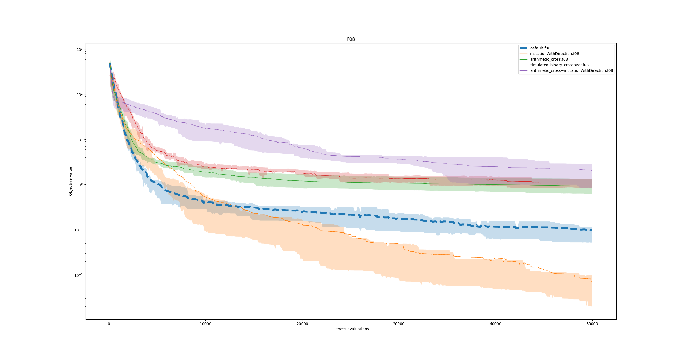
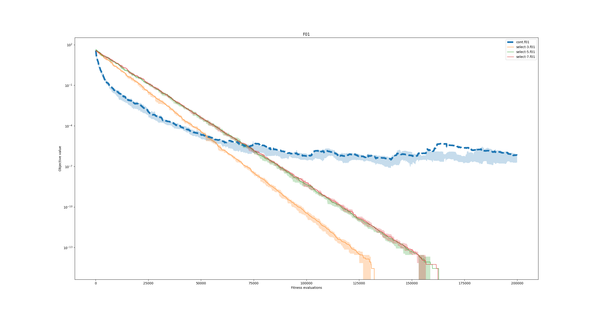
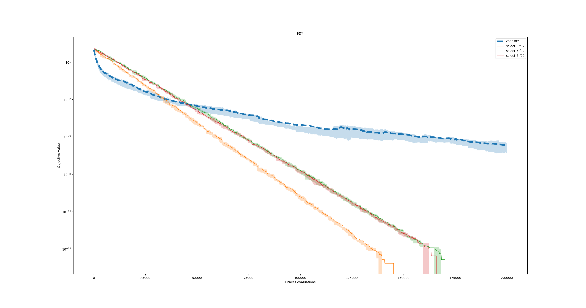
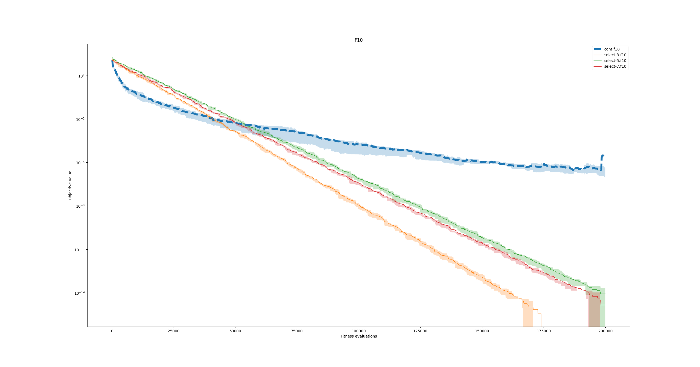
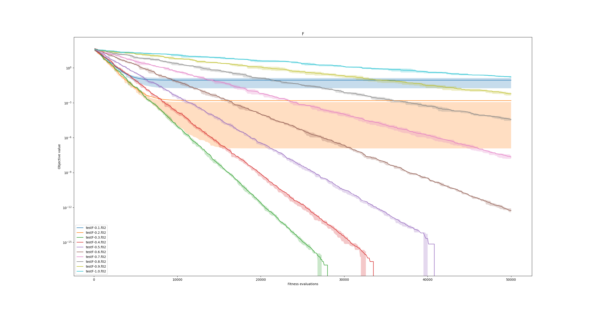

~David~ ~Napravnik~

---

# 3. HW CO + LB

## Zmenene operatory
### Arithmetic crossover
```python
def arithmetic_cross(p1, p2):
    alpha = random.random()
    o1 = alpha * p1 + (1 - alpha) * p2
    o2 = alpha * p2 + (1 - alpha) * p1
    return o1, o2
```

### Simulated binary crossover
Tady jsem nastavoval vsechni mozne jako eta, ale nic nefungovalo a *generace + 20* fungovala nejlepe, i kdyz stale byla horsi nez *arithmetic crossover*
```python
def simulated_binary_crossover(p1, p2, generation):
    eta = 20 + generation
    o1 = p1[::]
    o2 = p2[::]
    for i, (x1, x2) in enumerate(zip(p1, p2)):
        rand = random.random()
        if rand <= 0.5:
            beta = 2. * rand
        else:
            beta = 1. / (2. * (1. - rand))
        beta **= 1. / (eta + 1.)
        o1[i] = 0.5 * (((1 + beta) * x1) + ((1 - beta) * x2))
        o2[i] = 0.5 * (((1 - beta) * x1) + ((1 + beta) * x2))
    return o1, o2
```


### Mutace 
Nahodny smer je ovlivnen vektorem s nahodnym jinym clenem populace

```python
def __call__(self, ind, pop):
	random_ind = pop[np.random.randint(0, len(pop))]
	direction_vector = random_ind - ind
	if np.all(direction_vector == 0):
		direction_vector = np.random.normal(size=ind.shape)
	direction_vector /= np.linalg.norm(direction_vector)
	return ind + self.step_size * direction_vector
```

### Grafy

Ackoliv se *arithmetic crossover* i mutacce chovali samostatne skvele, tak jejich kombinace, az tak skvele nedopadla.





## Differencialni evoluce
```python
def differential_evolution(pop, max_gen, fitness, operators, mate_sel, mutate_ind, *, map_fn=map, log=None):
    NP = POP_SIZE
    CR = 0.9
    F = 0.8
    evals = 0

    for G in range(max_gen):
        fits_objs = list(map_fn(fitness, pop))
        evals += len(pop)
        if log:
            log.add_gen(fits_objs, evals)
        new_pop = []
        for x_index in range(POP_SIZE):
            x = pop[x_index]
            while True:
                companions = [random.randrange(0, POP_SIZE) for _ in range(7)]
                [a, b, c, d, e, f, g] = companions
                companions.append(x_index)
                unique = len(set(companions)) == 8
                if unique:
                    break
            randomIndex = random.randrange(0, DIMENSION)
            y = [0 for i in range(DIMENSION)]
            [a, b, c, d, e, f, g] = [pop[a], pop[b], pop[c], pop[d], pop[e], pop[f], pop[g]]
            for i in range(DIMENSION):
                if i == randomIndex or random.random() < CR:
                    y[i] = a[i] + F * (b[i] - c[i]) # + F * (d[i] - e[i]) + F * (f[i] - g[i])
                else:
                    y[i] = x[i]
            if fitness(y).fitness > fitness(x).fitness:
                new_pop.append(y)
            else:
                new_pop.append(x)
        pop = new_pop[::]
    return pop
```

### Pocet jedincu v mutaci (3, 5 a 7)
```python
# select-3
F = 0.8
y[i] = a[i] + F * (b[i] - c[i])
# select-5
F = 0.8/1.33 # average length of 2 normalized 3d vectors
y[i] = a[i] + F * (b[i] - c[i]) + F * (d[i] - e[i])
# select-7
F = 0.8/1.62 # average length of 3 normalized 3d vectors
y[i] = a[i] + F * (b[i] - c[i]) + F * (d[i] - e[i]) + F * (f[i] - g[i])
```

### Grafy
Zde porovnavam continuous evoluci (`cont`) s differencialni (`select`) s ruznym mnozstvim jedincu pro mutaci (3, 5, 7)







### Zmena parametru F a CR




